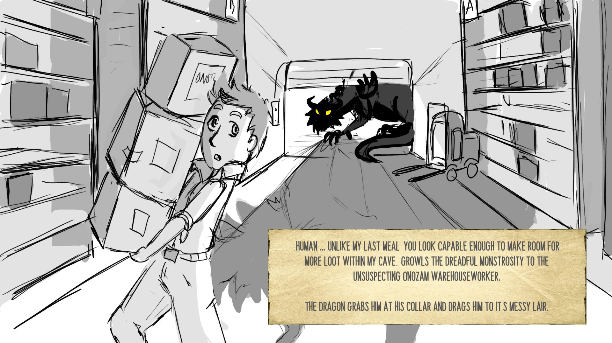
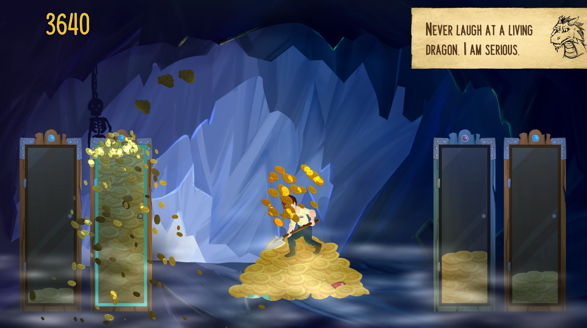
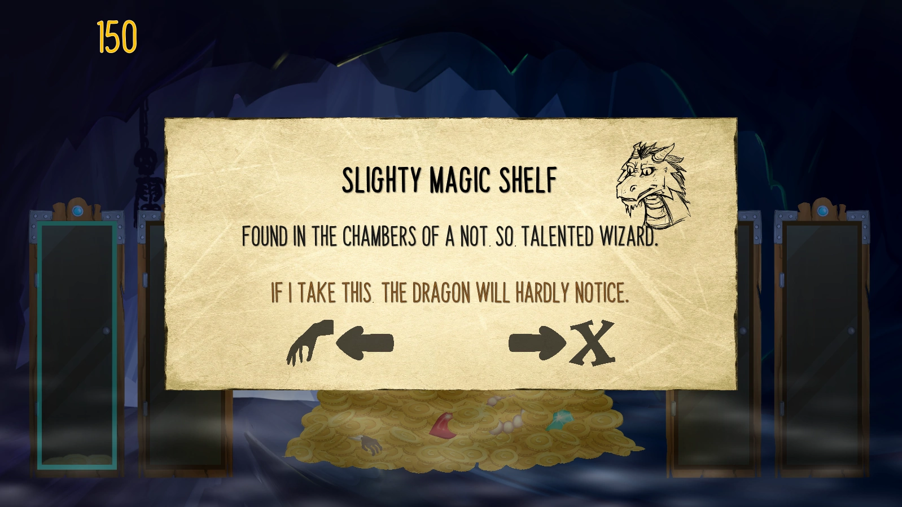

# How to please a Dragon

Shovel for your life! The dragon loots like a maniac and its lair is almost bursting of gold. Shovel, shovel, shovel and steal trinkets to upgrade your shovel and coin containers! But be careful not to enrage the dragon.

You already know that there is no escape and no way of surviving this. How long will you last until you run out of space?

Made for the [Ludum Dare #42](https://ldjam.com/) game jam.

### [Play on itch.io](https://kruemelkatze.itch.io/how-to-please-a-dragon)

### [Download Executable](./Releases)

  
 

---

Made by [Dirty Paws Studio](https://dirtypaws.studio), [GuentherK](https://github.com/GuentherK), and [peterjochum](https://github.com/peterjochum). Thanks to Jonathan Harris, David Kerkhoff, Dennis Ludlow for their free fonts.

